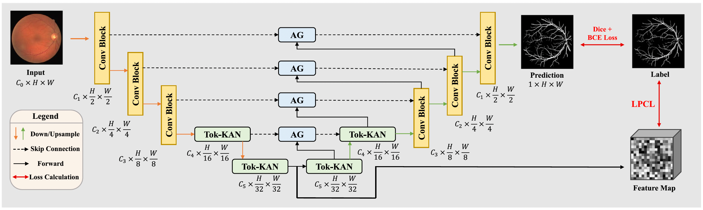

# AttUKAN: Novel Extraction of Discriminative Fine-Grained Feature to Improve Retinal Vessel Segmentation

[](https://doi.org/10.1016/j.imavis.2025.105729)
[](https://github.com/stevezs315/AttUKAN)
[](https://stevezs315.github.io/)


Shuang Zeng, Chee Hong Lee, Micky C. Nnamdi, Wenqi Shi, J. Ben Tamo, Hangzhou He, Xinliang Zhang, Qian Chen, May D. Wang, Lei Zhu*, Yanye Lu*, Qiushi Ren*

*MILab, Department of Biomedical Engineering, Peking University*

*Corresponding Authors: [yanye.lu@pku.edu.cn](mailto:yanye.lu@pku.edu.cn)*

---

## Introduction

Retinal vessel segmentation is an important step for early screening and quantitative analysis of ocular and systemic diseases such as diabetic retinopathy and hypertensive retinopathy. However, fundus vessel segmentation remains challenging because retinal vessels are thin, tortuous, low-contrast, and easily confused with illumination artifacts, optic disk regions, and pathological lesions.

We propose **AttUKAN**, an Attention U-shaped Kolmogorov-Arnold Network for retinal vessel segmentation, together with a **Label-guided Pixel-wise Contrastive Loss (LPCL)**. AttUKAN strengthens fine-grained feature extraction by combining:

- **Attention Gates (AGs)** on skip connections to suppress irrelevant activations and enhance vessel-specific features
- **Tokenized KAN blocks** to improve non-linear modeling and model interpretability
- **LPCL** to pull foreground vessel-pixel features together, pull background-pixel features together, and push vessel/background features apart

> **TL;DR:** AttUKAN integrates Attention Gates into UKAN and uses label-guided pixel-wise contrastive learning to extract more discriminative fine-grained features for accurate retinal vessel segmentation.

---

## News

- **[2025-09-18]** Paper available online in *Image and Vision Computing*, Vol. 163, 105729.
- **[2025-09-02]** Paper accepted by *Image and Vision Computing*.

---

## Method Overview



AttUKAN follows a U-shaped encoder-decoder architecture. The encoder contains three convolutional blocks and two tokenized KAN blocks, while the decoder symmetrically reconstructs segmentation maps. Attention Gates are inserted into skip connections to selectively refine encoder features before they are passed to the decoder.

The overall training objective combines standard segmentation losses and the proposed LPCL:

$$
\mathcal{L}_{all} =
\lambda_1 \mathcal{L}_{BCE} +
\lambda_2 \mathcal{L}_{jaccard} +
\lambda_3 \mathcal{L}_{dice} +
\lambda_4 \mathcal{L}_{LPCL}
$$

**Key modules:**

- **AttUKAN Architecture**: Incorporates Attention Gates into UKAN to filter feature-level fine-grained representations through skip connections
- **Tokenized KAN Block**: Uses KAN layers and depth-wise convolution to enhance non-linear modeling for fine vascular structures
- **LPCL**: Constructs positive and negative pixel pairs from ground-truth labels, encouraging intra-class compactness and inter-class separation in feature space

---

## Results

Experiments are conducted on four public retinal vessel datasets, including [DRIVE](http://www.isi.uu.nl/Research/Databases/DRIVE/), [STARE](http://cecas.clemson.edu/~ahoover/stare/), [CHASE_DB1](https://blogs.kingston.ac.uk/retinal/chasedb1/), [HRF](https://www5.cs.fau.de/research/data/fundus-images/), and one private dataset.

AttUKAN achieves state-of-the-art performance compared with 11 retinal vessel segmentation networks, including UNet, DUNet, DSCNet, IterNet, CTFNet, BCDUNet, AttUNet, UNet++, RollingUNet, MambaUNet, and UKAN.

Across DRIVE, STARE, CHASE_DB1, HRF, and the private dataset, AttUKAN achieves F1 scores of **82.50%**, **81.14%**, **81.34%**, **80.21%**, and **80.09%**, with MIoU scores of **70.24%**, **68.64%**, **68.59%**, **67.21%**, and **66.94%**, respectively.

---

## Preparing Datasets

To prepare the dataset in HDF5 format, run:

```bash
python prepare_dataset.py
```

You can modify the dataset name in `configuration.txt`.

### Available Datasets

[DRIVE](http://www.isi.uu.nl/Research/Databases/DRIVE/), [STARE](http://cecas.clemson.edu/~ahoover/stare/), [CHASE_DB1](https://blogs.kingston.ac.uk/retinal/chasedb1/), [HRF](https://www5.cs.fau.de/research/data/fundus-images/)

---

## Run the Full Workflow

The workflow consists of two main steps:

1. **Training** an AttUKAN model
2. **Testing** the trained AttUKAN model

### Train AttUKAN

To start training, run:

```bash
python pytorch_train.py
```

- Model architecture and training settings are configured in `configuration.txt`.
- Number of sub-images (`N_subimgs`) for different datasets:
  - DRIVE & STARE: **20,000**
  - CHASE_DB1: **21,000**
  - HRF: **30,000**
  - Private dataset: **90,000**
- Training parameters:
  - **Epochs** (`N-epochs`): 100
  - **Batch size** (`batch_size`): 35
  - **Learning rate** (`lr`): 3e-3

### Test AttUKAN

To test the trained model, run:

```bash
python pytorch_predict_fcn.py
```

- **Stride settings** for testing:
  - DRIVE, STARE, CHASE_DB1: `stride_height = 5`, `stride_width = 5`
  - HRF, Private dataset: `stride_height = 10`, `stride_width = 10`

### Pretrained Model

The pretrained models used in the paper are available on [Google Drive](https://drive.google.com/drive/folders/126apXEpe_ZIhmOYQ68N50ZhIonwbcFjP?usp=sharing).

### Quantitative Evaluation

After completing all processes, run the following command to obtain evaluation results:

```bash
python evalution.py
```

---

## Citation

If this repository is useful for your research, please consider citing:

```bibtex
@article{zeng2025attukan,
  title = {Novel extraction of discriminative fine-grained feature to improve retinal vessel segmentation},
  author = {Zeng, Shuang and Lee, Chee Hong and Nnamdi, Micky C. and Shi, Wenqi and Tamo, J. Ben and He, Hangzhou and Zhang, Xinliang and Chen, Qian and Wang, May D. and Zhu, Lei and Lu, Yanye and Ren, Qiushi},
  journal = {Image and Vision Computing},
  volume = {163},
  pages = {105729},
  year = {2025},
  doi = {10.1016/j.imavis.2025.105729}
}
```

---

## Contact

- **Shuang Zeng** (First Author): [stevezs@pku.edu.cn](mailto:stevezs@pku.edu.cn)
- **Yanye Lu** (Corresponding Author): [yanye.lu@pku.edu.cn](mailto:yanye.lu@pku.edu.cn)

For questions and issues, please open a [GitHub Issue](https://github.com/stevezs315/AttUKAN/issues).

---

## Acknowledgement

I'm very grateful for my co-first author, Chee Hong Lee's (cheehong200292@gmail.com) diligent efforts and contributions.

Many thanks for codes of these baseline backbone networks, including [DUNet](https://github.com/RanSuLab/DUNet-retinal-vessel-detection), [DSCNet](https://github.com/YaoleiQi/DSCNet), [AttUNet](https://github.com/ozan-oktay/Attention-Gated-Networks), [UKAN](https://github.com/CUHK-AIM-Group/U-KAN), [RollingUNet](https://github.com/Jiaoyang45/Rolling-Unet), [MambaUNet](https://github.com/ziyangwang007/Mamba-UNet), [CTFNet](https://github.com/DLWK/CTF-Net), [IterNet](https://github.com/amri369/Pytorch-Iternet), [BCDUNet](https://github.com/rezazad68/BCDU-Net), [UNet++](https://github.com/MrGiovanni/UNetPlusPlus).

Transforms refer to [torchbiomed](https://github.com/mattmacy/torchbiomed).
